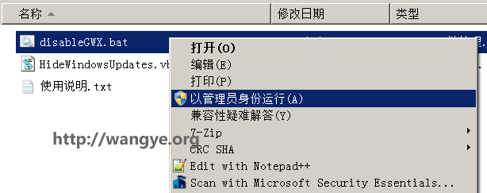

## 彻底关闭并卸载任务栏右下角获取Windows 10图标提示
[原文链接](http://wangye.org/blog/archives/1011/)

微软为推销Windows 10可谓是不遗余力，居然强制向广大的Windows 7和Windows 8/8.1用户进行了推送，其结果是小伙伴们发现电脑的右下角出现一个“获取 Windows 10”(英文版：Get Windows 10)的图标，但对于我这样的没有升级欲望的，看到这样的图标颇为不爽，打开任务管理器，居然还有一个GWX.exe的进程，罢了，罢了，反正我也知道可以升级Windows 10，但占用我可怜的内存资源则不能忍受了，所以决定卸载并移除该提示。

首先查阅了网上的资料，发现大家都从更新入手，已知更新代号为**KB3035583**，那么直接卸载，问题不是解决了吗？非也非也，该更新被标注为高优先级，也就是说只能解燃眉之急，不能做长久打算，过一段时间“获取 Windows 10”（为了简便，下文称为“GWX”）还是会死而复活。

那么正确的做法应该是卸载更新后再把该更新给隐藏起来，在下次收到该更新时，先右击再选择隐藏更新即可。

好了，问题似乎到这里得到了解决，当然作为一名久经沙场的程序猿，怎么能天真的认为微软叔叔会就此作罢，所以我收集了网上所有的方案，集多种致命武器于一身的“要你命3000”就此诞生（此处应有掌声）。

通过老外的[《Disable & Remove Get Windows 10 Upgrade Reservation Notification & System Tray Icon》](https://techjourney.net/disable-remove-get-windows-10-upgrade-reservation-notification-system-tray-icon/)得知微软还留了一手，那就是注册表大法，即通过注册表禁用该功能，将以下内容保存***DisableGWX.reg***，并双击运行即可：

	Windows Registry Editor Version 5.00
 
	[HKEY_LOCAL_MACHINE\SOFTWARE\Policies\Microsoft\Windows\Gwx]
	"DisableGwx"=dword:00000001

好了，就此彻底将GWX打入冷宫。

总结来看，我们依次进行了三步，首先卸载了KB3035583的更新；其次隐藏了KB3035583的更新；最后通过注册表彻底禁用GWX。

当然本着方便群众的精神，我将其打包成了批处理和VBScript脚本，其中VBScript脚本是供批处理调用的，主要是实现隐藏指定KB更新的功能（抱歉，这个功能的实现只有VBS版的，所以这里累赘的分成两个文件），脚本来源于[《Block specific windows update hotfix》](http://serverfault.com/questions/145843/block-specific-windows-update-hotfix/341318#341318)，代码转载如下：

	'// Inspired by Colin Bowern: http://serverfault.com/a/341318
	If Wscript.Arguments.Count < 1 Then
	    WScript.Echo "Syntax: HideWindowsUpdates.vbs [Hotfix Article ID]" & vbCRLF & _
	        " - Examples: HideWindowsUpdates.vbs 2990214" & vbCRLF & _
	        " - Examples: HideWindowsUpdates.vbs 3022345 3035583"
	    WScript.Quit 1
	End If
	 
	Dim objArgs
	Set objArgs = Wscript.Arguments
	Dim updateSession, updateSearcher
	Set updateSession = CreateObject("Microsoft.Update.Session")
	Set updateSearcher = updateSession.CreateUpdateSearcher()
	 
	Wscript.Stdout.Write "Searching for pending updates..." 
	Dim searchResult
	Set searchResult = updateSearcher.Search("IsInstalled=0")
	 
	Dim update, kbArticleId, index, index2
	WScript.Echo CStr(searchResult.Updates.Count) & " found."
	For index = 0 To searchResult.Updates.Count - 1
	    Set update = searchResult.Updates.Item(index)
	    For index2 = 0 To update.KBArticleIDs.Count - 1
	        kbArticleId = update.KBArticleIDs(index2)
	 
	        For Each hotfixId in objArgs
	            If kbArticleId = hotfixId Then
	                If update.IsHidden = False Then
	                    WScript.Echo "Hiding update: " & update.Title
	                    update.IsHidden = True
	                Else
	                    WScript.Echo "Already hiddn: " & update.Title
	                End If          
	            End If
	        Next
	 
	    Next
	Next
	'// EOF

很明显，通过“HideWindowsUpdates.vbs KB号”即可隐藏指定KB号的更新，结合这篇文章[《How to disable the “Get Windows 10” icon shown in the notification area (tray)?》](http://superuser.com/questions/922068/how-to-disable-the-get-windows-10-icon-shown-in-the-notification-area-tray)，最终我编写的批处理如下：

	@ECHO OFF
	 
	ECHO Welcome to use GWX - Get Windows 10 Removal Tool
	ECHO For more information please visit http://wangye.org
	ECHO.
	 
	REM See http://stackoverflow.com/questions/4051883/batch-script-how-to-check-for-admin-rights
	goto check_Permissions
	 
	:check_Permissions
	    echo Administrative permissions required. Detecting permissions...
	 
	    net session >nul 2>&1
	    if %errorLevel% == 0 (
	        echo Success: Administrative permissions confirmed.
	    ) else (
	        echo Failure: Current permissions inadequate.
		GOTO Done
	    )
	 
	 
	ECHO Terminating process GWX.exe....
	taskkill /F /IM GWX.exe
	ECHO GWX.exe terminated.
	 
	ECHO Uninstalling KB3035583 Update, Please wait...
	start "title" /b /wait WUSA.exe /quiet /norestart /uninstall /kb:3035583
	ECHO KB3035583 uninstalled.
	 
	ECHO Adding Policy For Disable Gwx Software...
	reg add "HKEY_LOCAL_MACHINE\SOFTWARE\Policies\Microsoft\Windows\Gwx" /v DisableGwx /t REG_DWORD /d 1 /f
	ECHO DisableGwx Policy Added.
	 
	ECHO Removing GWX directory...
	del /f /s /a /q %SystemRoot%\System32\GWX
	ECHO GWX directory removed.
	 
	ECHO Hiding GWX Updates, Please wait...
	start "title" /b /wait cscript.exe //NoLogo "%~dp0HideWindowsUpdates.vbs" 3035583
	ECHO Done.
	 
	ECHO All steps completed, Please restart your computer!
	 
	:Done
	PAUSE
大家可以看到，其中有一段代码是`check_Permissions`，这段是检查运行环境是否在管理员权限下，因为我们的代码必须运行在管理员权限下，也就是说需要右击以“管理员身份运行”，这段代码来自[《Batch script: how to check for admin rights》](http://stackoverflow.com/questions/4051883/batch-script-how-to-check-for-admin-rights)，原代码如下：

	@echo off
	goto check_Permissions
	 
	:check_Permissions
	    echo Administrative permissions required. Detecting permissions...
	 
	    net session >nul 2>&1
	    if %errorLevel% == 0 (
	        echo Success: Administrative permissions confirmed.
	    ) else (
	        echo Failure: Current permissions inadequate.
	    )
	 
	    pause >nul
好啦，其他的代码不需要解释，大家应该都清楚，主要是结束GWX.exe进程，通过WUSA.exe工具卸载更新，通过`reg add`添加注册表项目，再强制移除`C:\Windows\System32\GWX`路径及包含文件，最后通过`HideWindowsUpdates.vbs`隐藏更新。通过这一系列操作，我想GWX再无翻身之日吧。

对于不拘小节的朋友们，我提供了打包好的程序[点击下载](http://wangye.org/blog/wp-content/uploads/2015/07/2015-07-19_08-32-19.zip)DisableGWX，解压后，直接右击disableGWX.bat，选择以“管理员身份运行”，稍等片刻等出现**“All steps completed, Please restart your computer!”**时候重启电脑即可完成。

如果出现 **Failure: Current permissions inadequate.** 则表明程序没有以管理员身份运行，部分过程处理时间可能较长，请耐心等待，尤其是Please wait…提示的时候。

代码已经由32位 Windows 7 SP1 专业版测试通过，其他版本Windows建议谨慎考虑。

本人在windows 7 x64 测试可以使用。

[本地下载](./disable_windows10.zip)

[源地址](http://wangye.org/blog/wp-content/uploads/2015/07/2015-07-19_08-32-19.zip)
